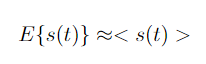
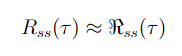
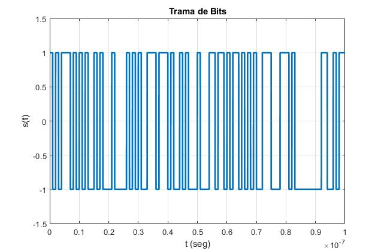
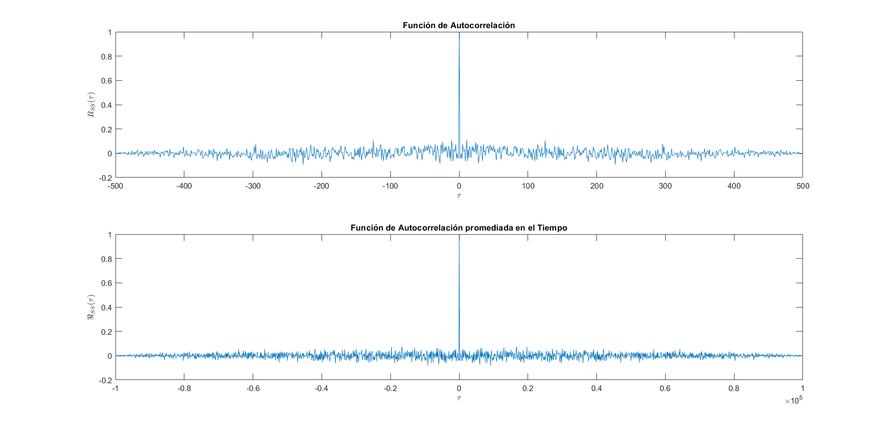
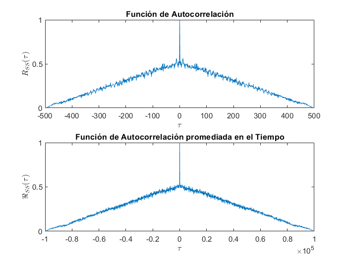
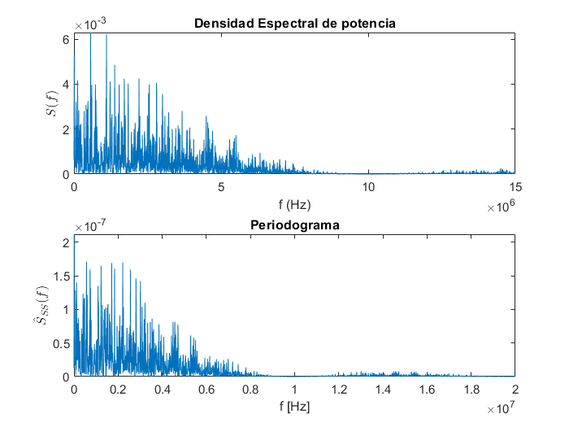

# ErgodicProcess

Demonstration that a bit frame is configured in an Ergodic Process.

```bash
git clone git@github.com:ndcastillo/ErgodicProcess.git && cd ErgodicProcess && ls -alh
```

### What are we trying to prove?

That mean for stationary process in a instanteous time is equal a mean of a realization, also that autocorrelation for a random variable is equal that autocorrelation for a realization. Therefore, this stationary process will be an ergodic process.





A total of 500 random bit frames (runs) are generated with a quantity of $1000  [bits] where the bit time is T_b=1 [ns]. The generation of the random bits is done with the Matlab function `rand()`, which is configured with a uniform distribution. In addition, a Amplitude Modulator block will be simulated to obtain values of ak={-1,+1}. With these conditions it is intended to observe the PCM system.

### PCM signal.

This signal was generate with a random impulse train. Now, The P-NRZ was the Line code used, width Vpp = 2 [V].









