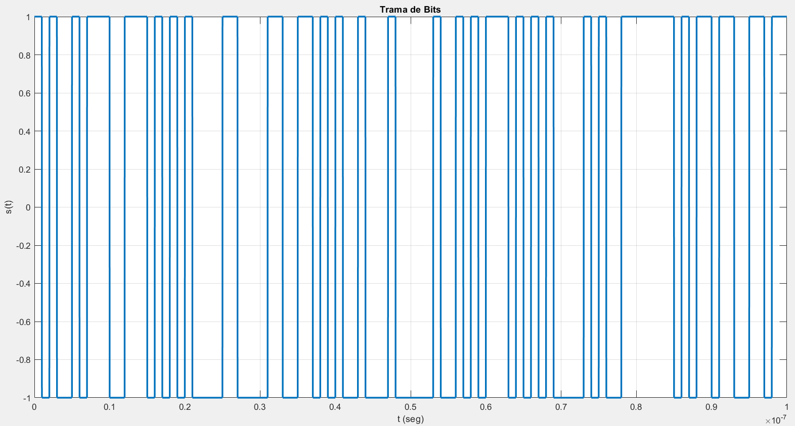
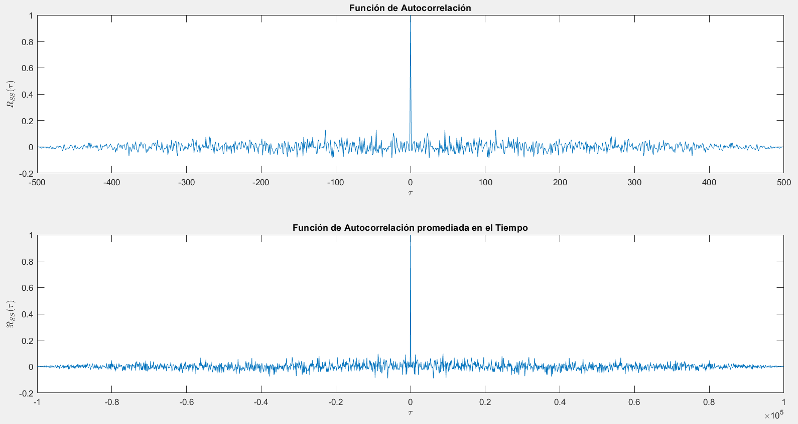
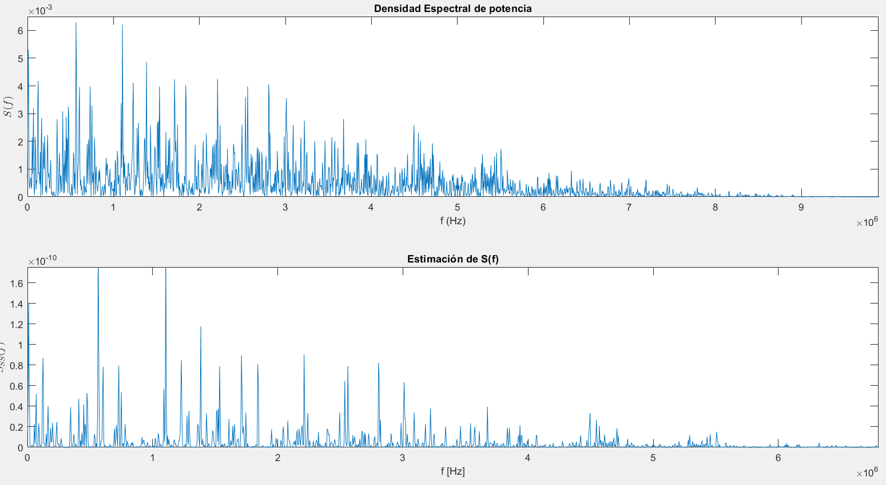

# ErgodicProcess

Demonstration that a bit frame is configured in an Ergodic Process.

```bash
git clone git@github.com:ndcastillo/ErgodicProcess.git && cd ErgodicProcess && ls -alh
```

For a PCM experiment with 500 realizations and frames of length 1kbits, find the Average Mean, the Average Autocorrelation and the ensemble averages.






